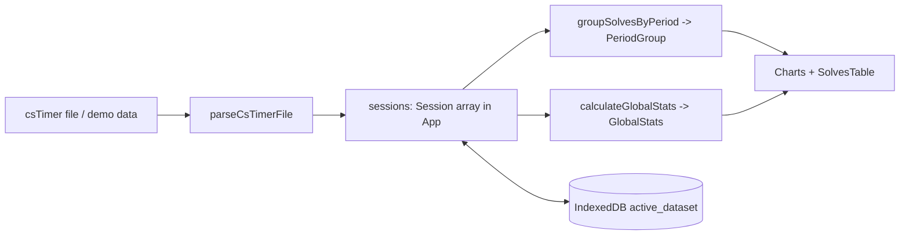

# AGENTS.md

Entrypoint for AI agents working in the **CubeProgression** repository (a.k.a. *Speedcubing
Progression Analyzer*). Read this first, then follow the links into [`docs/`](./docs/README.md).

## What this is

A **client-only** React 19 + TypeScript 7 SPA that turns [csTimer](https://cstimer.net/)
solve exports into progression dashboards: rolling WCA averages, PB timelines, box plots,
KDE distribution shifts, and consistency metrics. Built with Vite 8 + Tailwind v4, charted
with Recharts 3 (plus one hand-written SVG box plot), persisted to IndexedDB. **No backend,
no network calls, no secrets.**

## Documentation map

| Document | Read it for |
| --- | --- |
| [`docs/architecture.md`](./docs/architecture.md) | Tech stack, directory layout, data flow, state ownership |
| [`docs/data-model.md`](./docs/data-model.md) | Domain types, csTimer file format, parsing pipeline |
| [`docs/statistics.md`](./docs/statistics.md) | `src/utils/statsMath.ts` — every algorithm explained |
| [`docs/components.md`](./docs/components.md) | Per-component props, behaviors, and tests |
| [`docs/storage.md`](./docs/storage.md) | IndexedDB schema and persistence behavior |
| [`docs/development.md`](./docs/development.md) | Setup, scripts, testing, Biome rules, conventions, gotchas |

## Orientation at a glance



- **Data in**: `src/utils/csTimerParser.ts` (`parseCsTimerFile`, `parseSolvesList`).
- **Math**: `src/utils/statsMath.ts` (`calculateAoN`, `calculateGlobalStats`,
  `calculatePbProgression`, `groupSolvesByPeriod`, `calculateKDE`, …). Pure and unit-tested.
- **Persistence**: `src/utils/dbStorage.ts` (IndexedDB, degrades to a no-op when unavailable).
- **State**: all dataset state lives in `src/App.tsx`; children are presentational.
- **Types**: everything cross-module is in `src/types.ts`.

## Commands

```bash
bun install            # install (Bun is the package manager)
bun run dev            # dev server → http://localhost:3000
bun run typecheck      # tsc --noEmit
bun run check          # Biome lint + format + import order (--write to fix)
bun run test           # Vitest (jsdom)
bun run test:coverage  # Vitest + v8 coverage
bun run test:e2e       # Playwright E2E tests (must be run)
bun run build          # production bundle → dist/
```

## Non-negotiable conventions

- **Biome formatting**: 2-space indent, LF, 100-col, **single quotes** in JS, **double
  quotes** in JSX, always semicolons, trailing commas everywhere, imports auto-organized.
  Run `bun run check:write` before finishing.
- **Keep `statsMath.ts` pure** — no React, no DOM, no I/O. Memoize in components with `useMemo`.
- **Write tests** for logic changes, colocated as `*.test.ts(x)`. The statistics engine is
  the most-tested surface; don't change math without updating `statsMath.test.ts`.
- **Run E2E tests (`bun run test:e2e`)** — all UI, layout, deferral, and persistence changes
  **must** pass the full Playwright E2E test suite. Vitest runs in `jsdom` where
  `IntersectionObserver` and real viewport geometry are absent, so E2E tests are mandatory to
  validate real browser rendering, responsive viewports, and deferred components.
- **Wrap charts in `ChartCardWrapper`** so they get PNG export + fullscreen for free.
- **Guard browser APIs** (`window`, `indexedDB`, `navigator`) — tests run in `jsdom`.
- **No backend / no secrets.** This is a static SPA.

## Gotchas agents trip on

- `d3`, `@types/d3`, and `@google/genai` are declared in `package.json` but **unused in
  `src`** — the box plot is hand-written SVG and there is no Gemini integration.
- IndexedDB is non-functional in `jsdom`, so tests always fall back to the **deterministic
  seeded demo dataset** (`generateSampleData()`), whose session title
  `F2L Yellow Cross Progression (Demo)` is asserted in `App.test.tsx`.
- Dates are computed in the **runtime local timezone** via standard `Temporal`; avoid
  timezone-sensitive test assertions.
- `ResponsiveContainer` is mocked to a fixed 800×400 box in `src/setupTests.tsx`.

## Where to make common changes

| Task | Files |
| --- | --- |
| Add/adjust a chart | `src/components/NewChart.tsx` (+ test), render in `src/App.tsx` |
| Change statistics | `src/utils/statsMath.ts` + `src/utils/statsMath.test.ts` |
| Support a new grouping period | `src/types.ts`, `statsMath.ts`, `src/components/FileUploader.tsx` |
| Change parsing/penalties/timestamps | `src/utils/csTimerParser.ts` (+ test) |
| Change persistence | `src/utils/dbStorage.ts` (+ test) |
| Demo data | `src/utils/sampleData.ts` (+ test) |

_See [`docs/README.md`](./docs/README.md) for the full documentation index._
