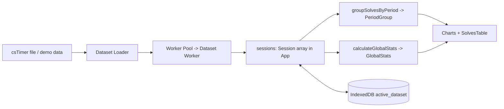

# AGENTS.md

Entrypoint for AI agents working in the **CubeProgression** repository (a.k.a. *Speedcubing
Progression Analyzer*). Read this first, then follow the links into [`docs/`](./docs/README.md).

## What this is

A **client-only** React 19 + TypeScript 7 SPA that turns [csTimer](https://cstimer.net/)
solve exports into progression dashboards: rolling WCA averages, PB timelines, box plots,
KDE distribution shifts, and consistency metrics. Built with Vite 8 + Tailwind v4, charted
with Recharts 3 (plus one hand-written SVG box plot), persisted to IndexedDB. **No backend,
no network calls, no secrets.**

## Documentation map

| Document | Read it for |
| --- | --- |
| [`docs/architecture.md`](./docs/architecture.md) | Tech stack, directory layout, data flow, state ownership |
| [`docs/data-model.md`](./docs/data-model.md) | Domain types, csTimer file format, parsing pipeline |
| [`docs/statistics.md`](./docs/statistics.md) | `src/utils/statsMath.ts` — every algorithm explained |
| [`docs/components.md`](./docs/components.md) | Per-component props, behaviors, and tests |
| [`docs/storage.md`](./docs/storage.md) | IndexedDB schema and persistence behavior |
| [`docs/development.md`](./docs/development.md) | Setup, scripts, testing, Biome rules, conventions, gotchas |

## Orientation at a glance



- **Data in**: `src/utils/csTimerParser.ts` (`parseCsTimerFile`, `parseSolvesList`), driven by
  the **Dataset Loader** (`src/utils/datasetLoader.ts`).
- **Off-thread parse**: `src/worker/` — `workerPool.ts` (reusable dispatcher + in-page
  fallback), `tasks.ts`/`protocol.ts` (typed task registry), `dataset.worker.ts` (the worker).
- **Math**: `src/utils/statsMath.ts` (`calculateAoN`, `calculateGlobalStats`,
  `calculatePbProgression`, `groupSolvesByPeriod`, `calculateKDE`, …). Pure and unit-tested.
- **Persistence**: `src/utils/dbStorage.ts` (the **Dataset Store**; IndexedDB, degrades to a
  no-op when unavailable).
- **State**: all dataset state lives in `src/hooks/useCubeDatasetCore.ts`; children are
  presentational.
- **Types**: everything cross-module is in `src/types.ts`.

## Commands

```bash
bun install            # install (Bun is the package manager)
bun run dev            # dev server → http://localhost:3000
bun run typecheck      # tsc --noEmit
bun run check          # Biome lint + format + import order (--write to fix)
bun run test           # Vitest (jsdom)
bun run test:coverage  # Vitest + v8 coverage
bun run test:e2e       # Playwright E2E tests (must be run; preview on :3200)
bun run build          # production bundle → dist/
bun run preview        # preview production bundle → http://localhost:3100
```

## Non-negotiable conventions

- **Biome formatting**: 2-space indent, LF, 100-col, **single quotes** in JS, **double
  quotes** in JSX, always semicolons, trailing commas everywhere, imports auto-organized.
  Run `bun run check:write` before finishing.
- **Keep `statsMath.ts` pure** — no React, no DOM, no I/O. Memoize in components with `useMemo`.
- **Temporal only — JS `Date` is strictly forbidden**: Never use JavaScript `Date` (`new Date()`, `Date.now()`, `Date.UTC()`, or the `Date` type) anywhere in source files, utilities, or test fixtures. All dates, timestamps, durations, and timezones must use ECMAScript standard `Temporal` (e.g. `Temporal.Now.instant().epochMilliseconds`, `Temporal.Instant`, `Temporal.PlainDate`, `Temporal.ZonedDateTime`). Biome enforces this via `noRestrictedGlobals` and `noRestrictedTypes`.
- **Write tests** for logic changes, colocated as `*.test.ts(x)`. The statistics engine is
  the most-tested surface; don't change math without updating `statsMath.test.ts`.
- **Test hygiene — pin behavior, not copy**: never select by, or assert on, user-facing
  strings. Banned: `getByText`/`findByText`/`queryByText`/`getAllByText`,
  `toHaveTextContent('…')`/`toContainText('…')`/`toHaveText(…)`/`toHaveDisplayValue(…)`,
  `getByRole(..., { name })`, Playwright `{ hasText }` and `text=`, `getByLabel*`, `getByTitle`,
  `getByPlaceholderText`, `getByDisplayValue`, `getByAltText`, `getByTestId`,
  CSS `[aria-label…]`/`[title…]`/`[data-testid…]` (including `*=`), and
  `data-testid`/`data-test-id`/`testId` — an `aria-label` is just a name lookup in disguise.
  Anchor on a plain `id`
  for a **distinct control/region** (don't overuse ids; never on decorative text) and assert on
  state/attributes/counts/behavior (`aria-pressed`, `toBeDisabled`, `toHaveValue`,
  `querySelectorAll().length`, `toHaveCount`, or a computed value read off the anchored node).
  No test-only hooks in production (test-only
  `className`/`aria-label`/inert props/ids on decorative nodes), no tautological assertions, no tests that only
  assert Tailwind classes, and guard selectors so a zero-match fails loudly. Enforced at
  `error` by the
  GritQL plugins in [`plugins/`](./plugins) via `biome.json`. See
  [`docs/development.md`](./docs/development.md#test-authoring--selector-hygiene).
- **Run E2E tests (`bun run test:e2e`)** — all UI, layout, deferral, and persistence changes
  **must** pass the full Playwright E2E test suite. Vitest runs in `jsdom` where
  `IntersectionObserver` and real viewport geometry are absent, so E2E tests are mandatory to
  validate real browser rendering, responsive viewports, and deferred components.
- **Navigate webpages with `agent-browser` (never grab raw HTML with `fetch`)**: Rather than grabbing HTML from webpages using `fetch` or HTTP requests, always use **`agent-browser`** CLI (`agent-browser open <url>`, `agent-browser snapshot -i`, `agent-browser read`, `agent-browser click`, etc.) to navigate webpages, inspect rendered content, and interact with web pages. Real browser automation ensures JavaScript SPAs, hydration, dynamic layouts, and client-rendered elements are fully evaluated.
- **Visual verification and page inspection with `agent-browser`**: Any UI or layout changes **must always be verified with screenshot confirmation and inspected** using **`agent-browser`** CLI (e.g. `agent-browser open <url>`, `agent-browser snapshot -i`, and `agent-browser screenshot screenshots/<name>.png`). **Always save screenshots into the `screenshots/` directory** (e.g. `screenshots/desktop-1280x800.png`, `screenshots/mobile-portrait-390x844.png`) so the project root stays clean. Visual verification across viewports (e.g. mobile portrait `390x844`, mobile landscape `844x390`, tablet portrait `768x1024`, and desktop `1280x800`) must be confirmed via `agent-browser set viewport <w> <h> 2` and `agent-browser screenshot screenshots/<viewport>.png` before finalizing work. Never assume visual layout correctness without visually inspecting the rendered screenshots to confirm balanced spacing, no element overlap, and no boundary overflow.
- **Wrap charts in `ChartCardWrapper`** so they get PNG export + fullscreen for free.
- **Guard browser APIs** (`window`, `indexedDB`, `navigator`) — tests run in `jsdom`.
- **No backend / no secrets.** This is a static SPA.

## Gotchas agents trip on

- `d3`, `@types/d3`, and `@google/genai` are declared in `package.json` but **unused in
  `src`** — the box plot is hand-written SVG and there is no Gemini integration.
- IndexedDB is non-functional in `jsdom`, so tests always fall back to the **deterministic
  seeded demo dataset** (`generateSampleData()`). Its main session is `session1`
  (`F2L Yellow Cross Progression (Demo)`), asserted at the **data layer** in
  `sampleData.test.ts` — UI tests must not assert that title via `getByText`.
- Dates are computed in the **runtime local timezone** via standard `Temporal`; avoid
  timezone-sensitive test assertions. Native JS `Date` is strictly forbidden across the entire codebase and tests.
- `ResponsiveContainer` is mocked to a fixed 800×400 box in `src/setupTests.tsx`.
- `Worker` is `undefined` under `jsdom`, so the **Worker Pool** falls back to its in-page
  adapter and unit tests never spawn a real worker; the dedicated-worker path is
  **E2E-only**. The worker is emitted as an **ES module** (`worker.format: 'es'` in
  `vite.config.ts`) because it dynamically imports the Temporal polyfill.

## Where to make common changes

| Task | Files |
| --- | --- |
| Add/adjust a chart | `src/components/NewChart.tsx` (+ test), render in `src/App.tsx` |
| Change statistics | `src/utils/statsMath.ts` + `src/utils/statsMath.test.ts` |
| Support a new grouping period | `src/types.ts`, `statsMath.ts`, `src/components/FileUploader.tsx` |
| Change parsing/penalties/timestamps | `src/utils/csTimerParser.ts` (+ test) |
| Change dataset loading | `src/utils/datasetLoader.ts` (+ test), `src/hooks/useCubeDatasetCore.ts` |
| Add/change a worker task | `src/worker/protocol.ts`, `src/worker/tasks.ts` (+ test) |
| Change persistence | `src/utils/dbStorage.ts` (+ test) |
| Demo data | `src/utils/sampleData.ts` (+ test) |

_See [`docs/README.md`](./docs/README.md) for the full documentation index._
