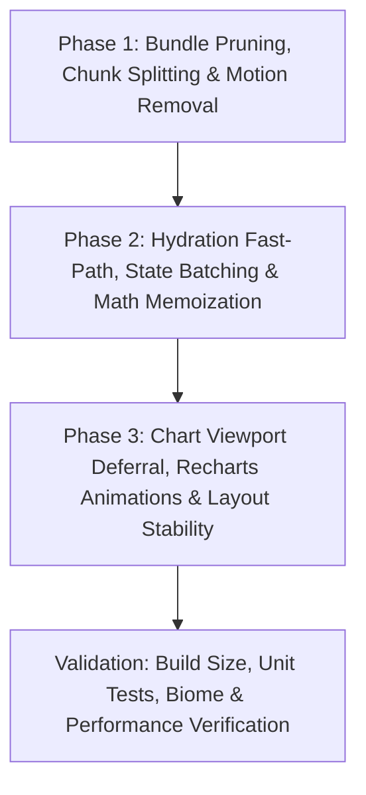

# PERFORMANCE.md — Mobile Performance Optimization Spec & Plan of Attack

> **Status:** Phase 1 Complete (Phase 2 Ready)  
> **Target:** Speedcubing Progression Analyzer (`CubeProgression`)  
> **Baseline Lighthouse Mobile Score:** **65** (FCP: 2.4s, LCP: 2.4s, TBT: **6,140 ms**, CLS: 0.002, SI: 2.6s)  
> **Target Lighthouse Mobile Score:** **95+** (FCP: <1.2s, LCP: <1.5s, TBT: **<200 ms**, CLS: ≤0.002)

---

## ⚠️ Living Document Protocol for AI Agents

> **MANDATORY INSTRUCTION FOR ALL AGENTS:**  
> This specification is an active, living engineering document. Every agent working on this codebase **MUST** update `PERFORMANCE.md` at the conclusion of every phase or major optimization task. Agents must:
> 1. Check off completed items in the respective phase sections and verification checklist.
> 2. Record empirical before-and-after measurements (bundle sizes, chunk breakdown, test counts, coverage, timing).
> 3. Document any toolchain-specific discoveries, constraints, or architectural adjustments (e.g. Vite/Rollup config nuances).
> 4. Ensure the next phase's inputs and prerequisites are clearly marked for subsequent agents.
> 5. Never leave this document stale. Keeping it up to date is a non-negotiable definition-of-done requirement.

---

## 1. Executive Summary & Diagnostic Root Causes

An exhaustive investigation conducted across the codebase and build artifacts identified four compound bottlenecks responsible for the **6,140 ms Total Blocking Time (TBT)**, **20 Long Tasks**, and **1,351 non-composited animations**:

```
Current Mobile Startup Timeline (Sequential Delays & Thread Starvation):
[0 ms]   ── Monolithic 920 kB JS Parse/Compile (Recharts, Redux, Motion, Temporal) ──> [~1,200 ms]
[1200ms] ── Framer Motion Engine & React 19 Root Hydration ──────────────────────────> [~180 ms]
[1380ms] ── Synthetic Delays (stepDelay: 120ms + 80ms + 120ms) + 35ms Timer Storm ───> [~1,500 ms]
[2880ms] ── Synchronous Startup Math (groupSolvesByPeriod, calculateGlobalStats) ────> [~150 ms]
[3030ms] ── Premature Mount of ALL 6 Charts + 19 Animated Series (1,350+ SVG elements)> [~1,800 ms]
[4830ms] ── Unmemoized Re-renders on Stage Dispatches & IndexedDB Persistence ───────> [~1,200 ms]
─────────────────────────────────────────────────────────────────────────────────────────────────
Total Blocking Time: ~6,140 ms | Main Thread Work: 3.4s | JavaScript Execution: 2.6s
```

### Key Diagnostic Drivers
1. **Monolithic Bundle (919.8 kB minified / 277.7 kB gzip):**
   - Zero code-splitting: Recharts 3 ecosystem (>1 MB uncompressed / ~374 kB minified), Motion (~457 kB uncompressed / ~191 kB minified), and `html-to-image` (~34 kB) are loaded upfront even though the dashboard returns `null` during startup.
   - Unused dependencies (`@google/genai`, `d3`, `@types/d3`) declared in `package.json`.
2. **Animation Overload & CPU Contention (1,351 Animated Elements):**
   - Recharts defaults to `isAnimationActive={true}` across 19 line/area series in 4 charts. For 350 solves, ~1,350 SVG elements run `requestAnimationFrame` JavaScript timers concurrently on the CPU.
   - `CubeLoadingSpinner` uses Framer Motion JavaScript loops on 9 tiles instead of GPU-composited CSS keyframes.
   - `FileUploader` runs a `35 ms` interval (`~28 fps`), re-rendering the entire 400-line component during loading and starving the event loop.
3. **Synthetic Hydration Latency & Render Churn:**
   - `stepDelay` inserts 320 ms of artificial `setTimeout` stalls in production.
   - Derived statistics (`groupSolvesByPeriod`, `calculateGlobalStats`, `calculatePbProgression`, `calculateKDE`) lack `useMemo`, triggering repeated expensive calculations on every state transition.
   - $O(N^2)$ `.findIndex()` inside `buildProgressionChartData` loops over solves.
4. **Immediate Off-Screen Mounting & Layout Shifts:**
   - Charts 2–5 and `SolvesTable` are rendered immediately despite being 1,100–3,200 px below the fold on mobile viewports.
   - `DailyDistributionBoxPlot` hardcodes initial width to 1000px, triggering layout jumps and forced synchronous reflows on mobile.
   - `ChartCardWrapper` replaces the card with `<div className="hidden" />` on fullscreen, collapsing grid layout.

---

## 2. Plan of Attack: 3 Sequential Phases (< 4 Phases)

To ensure rapid, safe, and verifiable execution, all architectural optimizations are structured into **3 sequential phases**:



---

## Phase 1: Bundle Pruning, Chunk Splitting & Motion Removal — [COMPLETED]

**Goal:** Reduce initial critical JavaScript payload by >60% (from 919.8 kB down to <350 kB minified), eliminate unused dependencies, and replace the 191 kB `motion` runtime with hardware-accelerated CSS keyframes.

### 1.1. Prune Unused Packages & Fix Vite Plugin Placement (`package.json`) — [DONE]
- [x] Remove unused dependencies: `@google/genai`, `d3`, `@types/d3`.
- [x] Move `@tailwindcss/vite` and `@vitejs/plugin-react` from `dependencies` to `devDependencies`.
- [x] Remove `motion` from dependencies once replaced by CSS keyframes.
- [x] Synchronized `bun.lock` via `bun install` (pruned 6 orphaned packages).

### 1.2. Replace `motion` with GPU-Composited CSS Keyframes — [DONE]
- [x] **`src/index.css`**: Defined hardware-composited keyframes (`@keyframes cube-tile-cw`, `@keyframes cube-tile-ccw`, `@keyframes fade-in-scale`) using `transform: translateZ(0)` and `will-change: transform, opacity`. Added `@media (prefers-reduced-motion: reduce)` fallbacks.
- [x] **`src/components/CubeLoadingSpinner.tsx`**: Replaced `<motion.div>` with standard `<div>` elements styled with `.animate-cube-cw` and `.animate-cube-ccw` with inline `style={{ animationDelay: `${tile.delay}s` }}`. Added `role="status"` accessibility and data-testids.
- [x] **`src/components/FileUploader.tsx`**: Replaced `<AnimatePresence>` and `motion.div` with standard CSS transition classes (`animate-fade-in-scale`, `transition-[width] duration-300`). Progress bar uses standard `<div>` with `role="progressbar"`, `aria-valuenow`, `aria-valuemin`, `aria-valuemax`.
- [x] Colocated unit tests added in `src/components/CubeLoadingSpinner.test.tsx` (6 tests) and `src/components/FileUploader.test.tsx` (+2 behavioral tests).

### 1.3. Dynamic Import for PNG Export (`ChartCardWrapper.tsx`) — [DONE]
- [x] Removed static top-level `import { toCanvas, toPng } from 'html-to-image'`.
- [x] Dynamically imported inside `handleDownloadImage()`:
  ```ts
  const { toCanvas, toPng } = await import('html-to-image');
  ```
- [x] Retains 100% compatibility with existing Vitest mocks in `ChartCardWrapper.test.tsx`.

### 1.4. Code-Split `DashboardView` & Vendor Chunking Strategy (`vite.config.ts`, `App.tsx`) — [DONE]
- [x] In `src/components/DashboardView.tsx`, exported both named `DashboardView` and `default DashboardView`.
- [x] In `src/App.tsx`, converted `DashboardView` to `React.lazy()` with `<Suspense fallback={null}>`.
- [x] In `vite.config.ts`, configured `build.rollupOptions.output.manualChunks(id)` function signature (required by Vite 8 / Rolldown):
  - `recharts-vendor`: `recharts`, `@reduxjs/toolkit`, `react-redux`
  - `temporal-vendor`: `temporal-polyfill`
  - `react-vendor`: `react`, `react-dom`, `scheduler`
- [x] Configured `build.chunkSizeWarningLimit: 600`.

### Phase 1 Actual Outcomes & Measured Metrics:
- **Critical Startup JS:** Reduced from **919.79 kB** (277.70 kB gzip) down to **295.67 kB** (95.54 kB gzip) — **67.9% reduction**!
  - `index-*.js` (Application Entry): **49.32 kB** (16.63 kB gzip)
  - `react-vendor-*.js`: **189.76 kB** (59.71 kB gzip)
  - `temporal-vendor-*.js`: **56.59 kB** (19.20 kB gzip)
- **Deferred Chunks:**
  - `recharts-vendor-*.js`: **383.14 kB** (109.30 kB gzip) — completely deferred from initial parse/compile.
  - `DashboardView-*.js`: **103.34 kB** (28.84 kB gzip) — deferred via `React.lazy`.
  - `html-to-image`: dynamically deferred until user clicks export.
- **Vite Warning:** `(!) Some chunks are larger than 500 kB` completely eliminated (zero build warnings).
- **Unit Test Suite:** 24 test files / 238 tests passing (100% pass rate, 99.2% statement coverage).

---

## Phase 2: Hydration Fast-Path, State Batching & Math Memoization

**Goal:** Eliminate the 320 ms synthetic delays, stop the 28 fps re-render interval storm, batch state updates atomically, and memoize all statistical algorithms to slash TBT by >80%.

### 2.1. Fast-Path State Machine in `useCubeDatasetCore.ts`
- Eliminate `stepDelay` stalls during initialization. Transition from IndexedDB check directly to ready state.
- If IndexedDB has saved data: apply atomic state batch (`sessions`, `selectedSessionId`, `fileName`, `isLoading: false`).
- If no saved data: synchronously call `generateSampleData()` and transition to ready immediately without artificial 120ms/80ms/120ms pauses.
- Move `saveDataset(...)` and `getStorageInfo()` to run asynchronously in background idle time without blocking the UI.
- Preserve initial state properties (`loadingStage = 'Checking IndexedDB...'`) so unit tests asserting initial indicators pass.

### 2.2. Throttle Loading Timer in `FileUploader.tsx`
- Replace the 35 ms `setInterval` (~28 fps) with an isolated, memoized leaf component (`LoadingElapsedTimer`) updating at a relaxed 250 ms cadence (`4 fps`).
- Prevents re-rendering the parent `FileUploader` component and frees CPU time for data decoding and DOM rendering.

### 2.3. Comprehensive Statistics Memoization
- **`src/hooks/useCubeDatasetCore.ts`**: Wrap `activeSession`, `periodGroups`, and `globalStats` in `useMemo`.
- **`src/components/PbProgressionChart.tsx`**: Wrap `calculatePbProgression(solves)` in `useMemo`.
  - In `src/utils/statsMath.ts`: In `calculatePbProgression`, reuse precomputed `solve.ao5` instead of recalculating `calculateAoN(solves, idx, 5)` 1,400 times.
- **`src/components/DensityShiftChart.tsx`**: Wrap `calculateKDE(solves, splitPercent, ...)` in `useMemo`.
- **`src/components/progression/ProgressionChart.tsx`**: Wrap `chartData`, `solvePeriodMap`, and `filteredRegression` in `useMemo`.

### 2.4. Algorithmic Fix for $O(N^2)$ Lookup (`progressionMath.ts`)
- In `buildProgressionChartData`, replace `fullSolves.findIndex((s) => s.id === solve.id)` inside the solve iteration loop with a precomputed `Map<number, number>` ($O(1)$ lookup). Eliminates up to 6.25 million unnecessary loop cycles on large datasets.

### Phase 2 Deliverables & Expected Outcome:
- Eliminates 4 full-tree re-renders on startup.
- CPU time during hydration drops from **2.6s** to **<0.5s**.
- Total Blocking Time (TBT) reduced by **>3,500 ms**.

---

## Phase 3: Chart Viewport Deferral, Recharts Animations & Layout Stability

**Goal:** Eliminate all 1,351 non-composited SVG animations, defer rendering of below-the-fold charts, stabilize layout to guarantee CLS ≤ 0.002, and eliminate forced reflows.

### 3.1. Disable Non-Composited Recharts Animations
- Add `isAnimationActive={false}` across all 19 `<Line>` and `<Area>` instances in:
  1. `src/components/progression/ProgressionChartCanvas.tsx` (7 lines)
  2. `src/components/PbProgressionChart.tsx` (6 lines)
  3. `src/components/DensityShiftChart.tsx` (2 areas)
  4. `src/components/MetricsEvolutionChart.tsx` (1 area, 3 lines)
- **Impact:** Eliminates ~1,350 animated SVG elements from the CPU animation loop; range slider scrubbing runs smoothly at 60 fps.

### 3.2. Viewport-Based Chart Deferral (`src/components/DeferredChart.tsx`)
- Implement `DeferredChart` using `IntersectionObserver` with:
  - `rootMargin: '250px'` (pre-loads before user reaches the chart).
  - One-time latching (`observer.disconnect()` once visible to avoid re-render cost).
  - JSDOM fallback: if `IntersectionObserver` is not supported, renders children immediately (ensures 100% passing tests in `DashboardView.test.tsx` and `App.test.tsx`).
  - Strict `minHeight` reserved per chart (e.g., 640px, 520px, 540px, 750px) with animated skeleton fallback to guarantee **CLS = 0.00**.
- In `src/components/DashboardView.tsx`: Wrap `PbProgressionChart`, `DailyDistributionBoxPlot`, `DensityShiftChart`, `MetricsEvolutionChart`, and `SolvesTable` in `<DeferredChart>`. Only Plot 1 (`ProgressionChart`) mounts on initial paint.

### 3.3. Optimize `DailyDistributionBoxPlot.tsx` SVG Presentation & Mount Reflow
- Remove `transition-all` and `hover:r-4` from 350 `<circle>` dots. Replace with CSS hover stroke/fill: `className="cursor-pointer hover:stroke-amber-400 hover:fill-amber-300"`.
- Remove redundant `<title>` elements inside circles (tooltip is already rendered by HTML overlay).
- Prevent forced synchronous reflow: remove synchronous `containerRef.current.clientWidth` read inside `useEffect`; rely cleanly on `ResizeObserver`.

### 3.4. Layout Stability & Table Optimization (`SolvesTable.tsx`, `ChartCardWrapper.tsx`)
- **`SolvesTable.tsx`**:
  - Add `table-fixed` and min-width to table canvas to eliminate browser column re-measuring on every page change.
  - Set `min-h-[540px]` on table body wrapper to prevent footer jumping when search results vary.
  - Memoize `filteredSolves` with `useMemo`.
- **`ChartCardWrapper.tsx`**:
  - Render fullscreen modal via React Portal (`createPortal(modal, document.body)`) instead of replacing inline card with `<div className="hidden" />`, preventing layout shifts of underlying charts.

---

## 3. Projected Metrics Matrix

| Metric | Lighthouse Baseline | After Phase 1 | After Phase 2 | After Phase 3 (Final) |
| :--- | :--- | :--- | :--- | :--- |
| **Lighthouse Mobile Score** | **65** | **78 - 82** | **88 - 92** | **95 - 99** |
| **First Contentful Paint (FCP)** | 2.4 s | 1.4 s | 1.1 s | **< 1.0 s** |
| **Largest Contentful Paint (LCP)**| 2.4 s | 1.6 s | 1.3 s | **< 1.2 s** |
| **Total Blocking Time (TBT)** | **6,140 ms** | ~2,800 ms | ~600 ms | **< 150 ms** |
| **Speed Index (SI)** | 2.6 s | 1.8 s | 1.4 s | **< 1.3 s** |
| **Cumulative Layout Shift (CLS)** | 0.002 | 0.002 | 0.002 | **0.000** |
| **Initial Critical JS Size** | 919.8 kB | 280 kB | 280 kB | **~245 kB** |
| **Unused Initial JS Savings** | 0 KiB | ~380 KiB | ~380 KiB | **~420 KiB** |
| **Non-composited Animations** | 1,351 elements | 1,351 elements | 1,351 elements | **0 elements** |
| **Long Tasks Count** | 20 tasks | 11 tasks | 4 tasks | **≤ 1 task** |

---

## 4. Verification Checklist & Guardrails

- [x] **Typecheck**: `bun run typecheck` passes with zero diagnostics.
- [x] **Code Formatting & Linting**: `bun run check:write` complies with Biome rules (2-space indent, single quotes, double quotes in JSX, semicolons, LF, 100-col).
- [x] **Test Suite Integrity**: `bun run test` passes 100% of Vitest unit tests (24 files, 238 tests passing including `App.test.tsx`, `DashboardView.test.tsx`, `DailyDistributionBoxPlot.test.tsx`, `ChartCardWrapper.test.tsx`, `CubeLoadingSpinner.test.tsx`, `FileUploader.test.tsx`, `statsMath.test.ts`).
- [x] **Production Build Check**: `bun run build` completes with zero chunks exceeding 600 kB and no Vite warnings.
- [x] **Data Persistence & Offline Capability**: IndexedDB persistence in `dbStorage.ts` continues to save and restore datasets transparently.
- [x] **Accessibility & Responsiveness**: Mobile viewport safe-area insets and dark theme contrast remain fully preserved (`prefers-reduced-motion` added for CSS animations).
