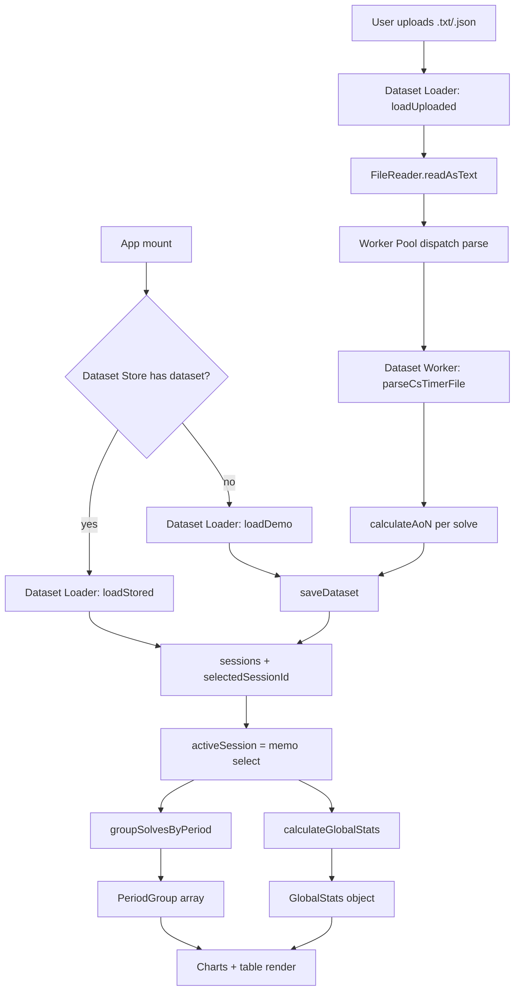

# Architecture

## What this app is

CubeProgression is a **100% client-side** analytics dashboard for speedcubers. It ingests
csTimer session exports (or a built-in demo dataset), computes rolling averages and
distribution statistics in the browser, persists the active dataset to IndexedDB, and
renders a set of interactive charts. There is no server, no API layer, and no runtime
network dependency.

## Tech stack

| Concern | Choice |
| --- | --- |
| Runtime / package manager | [Bun](https://bun.sh/) (`bun.lock`) |
| UI | React 19 + TypeScript 7 (`jsx: react-jsx`) |
| Build | Vite 8 with `@vitejs/plugin-react` and `@tailwindcss/vite` |
| Styling | Tailwind CSS v4 (`src/index.css`) |
| Charts | Recharts 3 (code-split, lazy) + hand-authored SVG (box plot) |
| Icons | `lucide-react` |
| Animation | GPU-accelerated CSS keyframes (no runtime motion library) |
| Dates/timezones | Standard `Temporal` (browser native) with conditional dynamic polyfill (`temporalLoader.ts`); native JS `Date` is strictly forbidden |
| PNG export | `html-to-image` (dynamically imported) |
| Persistence | Native IndexedDB |
| PWA / Offline | Zero-dependency Service Worker precache (`vitePwaPlugin`) + Web App Manifest |
| Lint / format | Biome 2 |
| Tests | Vitest 5 + React Testing Library + `jsdom` |

The app is configured to run from AI Studio: `vite.config.ts` disables HMR when the
`DISABLE_HMR` env var is `"true"`. All unused legacy dependencies (`@google/genai`, `d3`,
`motion`) have been removed.

## Directory layout

```
CubeProgression/
├── docs/                     # ← this documentation
├── public/                   # static assets served by Vite (favicon.svg)
├── assets/.aistudio/         # AI Studio metadata (not imported by app code)
├── src/
│   ├── components/           # all React components (+ colocated *.test.tsx)
│   ├── hooks/                # custom React hooks (useCubeDataset + *.test.ts)
│   ├── worker/               # Dataset Worker + reusable Worker Pool (protocol, tasks, pool)
│   ├── utils/                # pure logic: parsing, stats, storage, sample data (+ *.test.ts)
│   ├── App.tsx               # presentation shell connecting useCubeDataset to layout
│   ├── App.test.tsx          # integration test of the shell
│   ├── main.tsx              # testable React root entrypoint (mountApp)
│   ├── main.test.tsx         # unit test for root mounting
│   ├── index.css             # Tailwind entrypoint
│   ├── setupTests.tsx        # Vitest/jsdom polyfills + Recharts mock
│   ├── types.ts              # all domain interfaces
│   └── vite-env.d.ts         # Vite client types
├── index.html                # HTML shell (#root + module script)
├── vite.config.ts            # Vite + Vitest config, `@` alias
├── tsconfig.json             # TS config
├── biome.json                # Biome config
└── package.json              # scripts + deps
```

`dist/`, `coverage/`, `node_modules/`, and `.tmp/` are generated and git-ignored.

## Path aliases

Both Vite and TypeScript map the `@` prefix to the **project root** (not `src`):

- `vite.config.ts`: `'@' → path.resolve(import.meta.dirname, '.')`
- `tsconfig.json`: `"@/*": ["./*"]`

So `@/src/utils/statsMath` resolves correctly, but existing code almost always uses
relative imports (e.g. `../../utils/statsMath`). Node built-ins use the `node:` prefix
(`node:path` in `vite.config.ts`).

## Runtime data flow



The single source of truth is `sessions: Session[]` managed by `useCubeDatasetCore()` in
`src/hooks/useCubeDatasetCore.ts`. Everything downstream is derived with `useMemo` from
`activeSession`, `groupingPeriod`, and `customBatchSize`.

## State ownership (`useCubeDatasetCore.ts`)

| State | Purpose |
| --- | --- |
| `sessions` | All parsed sessions (the canonical data) |
| `selectedSessionId` | Which session the dashboard shows |
| `groupingPeriod` | `daily` \| `weekly` \| `monthly` \| `customBatch` \| `batch50` |
| `customBatchSize` | Batch size used when `groupingPeriod === 'customBatch'` |
| `fileName` | Display name of the loaded dataset |
| `errorMsg` | Parse/read error surfaced in `FileUploader` |
| `isSaved`, `storageUsageMB`, `savedNotice` | IndexedDB status UI |
| `isLoading`, `loadingProgress`, `loadingStage`, `uploadingFileName` | Animated loading overlay |

Everything derived (`activeSession`, `periodGroups`, `globalStats`) is computed with
`useMemo`. Child components are presentational and receive data + callbacks via props;
they do **not** read from a store or context.

Persisted settings: whenever the user changes session, grouping period, or batch size,
`useCubeDatasetCore.ts` calls `saveDataset(...)` fire-and-forget to keep IndexedDB in sync.

## Dataset Pipeline (off-thread loading)

The dataset lifecycle is split into four named seams (see [`GLOSSARY.md`](../GLOSSARY.md)):

- **Dataset Loader** (`src/utils/datasetLoader.ts`) — the page-side seam that turns an
  uploaded csTimer export, a stored dataset, or the demo into a ready-to-render session. It
  reads bytes, dispatches the parse to the Worker Pool, persists through the Dataset Store,
  and reports stage-based progress (`reading → parsing → persisting → ready`). It holds no
  React state; the hook maps stages onto the loading overlay.
- **Dataset Worker** (`src/worker/dataset.worker.ts`) — the dedicated, page-bound module
  worker. It owns no persistence; its `parse` task runs `parseCsTimerFile` off the main
  thread and returns a structured-cloneable `Session[]`. It calls `ensureTemporal()` in its
  own realm, because the page's Temporal polyfill does not cross the worker boundary.
- **Worker Pool** (`src/worker/workerPool.ts`) — the reusable, task-agnostic dispatcher. It
  is a typed request/response protocol (`src/worker/protocol.ts`) with the shared handlers in
  `src/worker/tasks.ts`, run on a small `hardwareConcurrency`-bounded pool of long-lived
  workers. When `Worker` is unavailable (Vitest's jsdom, or a degraded browser) it resolves
  to an in-page adapter that runs the identical handler on the calling thread, so the port
  has two adapters behind one interface.
- **Dataset Store** (`src/utils/dbStorage.ts`) — IndexedDB persistence, unchanged and
  always page-side.

Parsing is the only offloaded computation: `calculateGlobalStats` is negligible and
`groupSolvesByPeriod` is interactive, so both stay on the main thread. See
[`docs/adr/0001-off-thread-dataset-loading-with-a-worker-pool.md`](./adr/0001-off-thread-dataset-loading-with-a-worker-pool.md).

> Build note: the worker dynamically imports the Temporal polyfill, which forces code
> splitting, so `vite.config.ts` sets `worker.format: 'es'` and the pool constructs workers
> with `{ type: 'module' }`.

## Performance & Code-Splitting Architecture

To guarantee rapid initial mobile paint (<0.5s FCP) and eliminate main-thread blocking time:

- **Vendor Chunking (`vite.config.ts`)**: Configures `manualChunks` into `react-vendor`, `recharts-vendor`, and `temporal-vendor`. `modulePreload` excludes heavy deferred vendors (`recharts-vendor`, `temporal-vendor`) from the critical HTML parse path, while compiled CSS is inlined directly into `index.html`.
- **Zero-Recharts Initial Paint**: `DashboardView` and all Recharts-based chart canvases are loaded dynamically via `React.lazy` inside `<Suspense fallback={...}>`. Plot 1 (`ProgressionChart`) renders its shell and controls synchronously on Frame 0, deferring the Recharts SVG canvas mounting to browser idle time (`requestIdleCallback`). Initial page load executes 0 kB of Recharts code.
- **Conditional Temporal Polyfilling**: `src/utils/temporalLoader.ts` (`ensureTemporal()`) dynamically imports `temporal-polyfill` only when `typeof globalThis.Temporal === 'undefined'`. Modern browsers execute standard native `Temporal` and transfer 0 bytes of polyfill code.
- **Cooperative Task Scheduling**: `src/utils/scheduler.ts` (`yieldToMain()`) yields to the browser event loop via `scheduler.yield()` before atomic state flushes, ensuring initialization tasks remain below the 50 ms long-task budget.
- **Viewport-Driven Rendering**: Below-the-fold charts and heavy tables are wrapped in `<DeferredChart>`, mounting only when within 250px of the viewport using `IntersectionObserver` (or immediately in test/jsdom environments).
- **Static Inlined Shell**: `index.html` embeds a lightweight static CSS/SVG shell in `#root` matching the exact responsive coordinates (`px-4 sm:px-6 safe-area-x`, `safe-area-top`, `#0c0a09` continuity) to ensure instant first paint before JavaScript hydration completes.
- **Atomic Hydration**: Storage queries and dataset checks in `useCubeDatasetCore.ts` resolve concurrently and batch into a single state update, eliminating redundant hydration re-render passes.

## PWA & Offline Architecture

CubeProgression operates as a fully installable, 100% offline-first Progressive Web App:

- **Zero-Dependency Service Worker (`src/plugins/vitePwaPlugin.ts`)**: Generates and emits `sw.js` at build time by reading all emitted chunks and public static assets from Vite's bundle manifest.
- **Deterministic Precache**: On `install`, all application shell assets (compiled JS chunks, inlined and external CSS, SVGs, icons, and `index.html`) are precached into a content-hashed cache bucket (`cubeprogression-v-<hash>`).
- **Caching Strategy**:
  - **Navigation requests (`request.mode === 'navigate'`)**: Network-First with cached fallback to `index.html`. Users receive instantaneous startup offline while getting the latest build when online.
  - **Static assets (`assets/*`)**: Cache-First with network fallback. Because Vite filenames are content-hashed, cached assets are immutable.
  - **Auto-Cleanup**: On `activate`, outdated cache buckets from previous releases are purged, followed by `self.clients.claim()`.
- **Install & Connectivity UX**: the client-side browser lifecycle is split into focused deep modules under `src/pwa/`, since application installation and Service Worker lifecycle are independent browser mechanisms with different callers:
  - `src/pwa/useAppInstall.ts` — the **App Installation Module**: captures `beforeinstallprompt` on Chromium, adapts to the `@khmyznikov/pwa-install` bridge for iOS/Safari/Firefox, detects standalone display mode, and exposes the install / open-in-app action.
  - `src/pwa/useServiceWorkerUpdate.ts` — the **Service Worker Lifecycle Module**: registers the worker, detects update readiness (`waiting`), and performs the atomic skip-waiting reload. Registration and reload live behind this one seam; there is no separate `utils/pwaRegister` utility.
  - `src/pwa/useOnlineStatus.ts` — the **Connectivity State** module (`online` / `offline` events).
  - `src/pwa/PwaLifecycleView.tsx` encapsulates the cross-browser install bridge adapter (`pwa-install`) and the Service Worker update toast within a single presentation module.
  - `Navbar` consumes `useAppInstall` and `useOnlineStatus` to surface the tailored "Install App" / "Open in App" button and the "Offline mode" pill.
