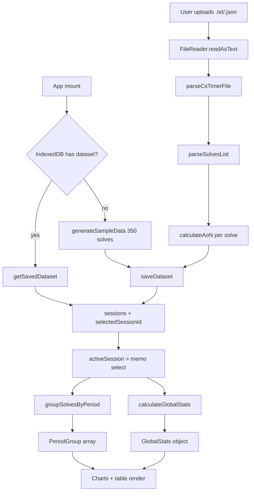

# Architecture

## What this app is

CubeProgression is a **100% client-side** analytics dashboard for speedcubers. It ingests
csTimer session exports (or a built-in demo dataset), computes rolling averages and
distribution statistics in the browser, persists the active dataset to IndexedDB, and
renders a set of interactive charts. There is no server, no API layer, and no runtime
network dependency.

## Tech stack

| Concern | Choice |
| --- | --- |
| Runtime / package manager | [Bun](https://bun.sh/) (`bun.lock`) |
| UI | React 19 + TypeScript 7 (`jsx: react-jsx`) |
| Build | Vite 8 with `@vitejs/plugin-react` and `@tailwindcss/vite` |
| Styling | Tailwind CSS v4 (`src/index.css` is just `@import "tailwindcss";`) |
| Charts | Recharts 3 (most charts) + hand-authored SVG (box plot) |
| Icons | `lucide-react` |
| Animation | `motion` (imported as `motion/react`) |
| Dates/timezones | `temporal-polyfill` (`Temporal`) |
| PNG export | `html-to-image` (`toPng`, `toCanvas`) |
| Persistence | Native IndexedDB |
| Lint / format | Biome 2 |
| Tests | Vitest 5 + React Testing Library + `jsdom` |

The app is configured to run from AI Studio: `vite.config.ts` disables HMR when the
`DISABLE_HMR` env var is `"true"`. `metadata.json` advertises a Gemini capability, but
**no Gemini/`@google/genai` code exists in `src`** — treat that dependency as unused.

## Directory layout

```
CubeProgression/
├── docs/                     # ← this documentation
├── public/                   # static assets served by Vite (favicon.svg)
├── assets/.aistudio/         # AI Studio metadata (not imported by app code)
├── src/
│   ├── components/           # all React components (+ colocated *.test.tsx)
│   ├── utils/                # pure logic: parsing, stats, storage, sample data (+ *.test.ts)
│   ├── App.tsx               # stateful shell: owns sessions, selection, grouping, loading
│   ├── App.test.tsx          # integration test of the shell
│   ├── main.tsx              # React root (createRoot + StrictMode)
│   ├── index.css             # Tailwind entrypoint
│   ├── setupTests.tsx        # Vitest/jsdom polyfills + Recharts mock
│   ├── types.ts              # all domain interfaces
│   └── vite-env.d.ts         # Vite client types
├── index.html                # HTML shell (#root + module script)
├── vite.config.ts            # Vite + Vitest config, `@` alias
├── tsconfig.json             # TS config
├── biome.json                # Biome config
└── package.json              # scripts + deps
```

`dist/`, `coverage/`, `node_modules/`, and `.tmp/` are generated and git-ignored.

## Path aliases

Both Vite and TypeScript map the `@` prefix to the **project root** (not `src`):

- `vite.config.ts`: `'@' → path.resolve(import.meta.dirname, '.')`
- `tsconfig.json`: `"@/*": ["./*"]`

So `@/src/utils/statsMath` resolves correctly, but existing code almost always uses
relative imports (e.g. `../../utils/statsMath`). Node built-ins use the `node:` prefix
(`node:path` in `vite.config.ts`).

## Runtime data flow



The single source of truth is `sessions: Session[]` in `App.tsx`. Everything downstream is
derived with `useMemo` from `activeSession`, `groupingPeriod`, and `customBatchSize`.

## State ownership (`App.tsx`)

| State | Purpose |
| --- | --- |
| `sessions` | All parsed sessions (the canonical data) |
| `selectedSessionId` | Which session the dashboard shows |
| `groupingPeriod` | `daily` \| `weekly` \| `monthly` \| `customBatch` \| `batch50` |
| `customBatchSize` | Batch size used when `groupingPeriod === 'customBatch'` |
| `fileName` | Display name of the loaded dataset |
| `errorMsg` | Parse/read error surfaced in `FileUploader` |
| `isSaved`, `storageUsageMB`, `savedNotice` | IndexedDB status UI |
| `isLoading`, `loadingProgress`, `loadingStage`, `uploadingFileName` | Animated loading overlay |

Everything derived (`activeSession`, `periodGroups`, `globalStats`) is computed with
`useMemo`. Child components are presentational and receive data + callbacks via props;
they do **not** read from a store or context.

Persisted settings: whenever the user changes session, grouping period, or batch size,
`App.tsx` calls `saveDataset(...)` fire-and-forget to keep IndexedDB in sync.

## Rendering pipeline

1. `main.tsx` mounts `<App />` in `StrictMode`.
2. `App` shows `FileUploader` (upload + session/grouping controls) and, when a session and
   stats exist, `MetricsOverviewCards`, four charts, and `SolvesTable`.
3. Every chart is wrapped by `ChartCardWrapper`, which provides the card chrome, a
   fullscreen modal, and PNG export via `html-to-image`.
4. Grouping metadata (labels/axis names) comes from `getPeriodUnitInfo` so charts stay
   consistent across grouping modes.

See [`components.md`](./components.md) for the per-component contract.
