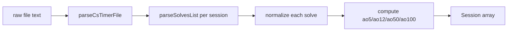

# Data Model & csTimer Parsing

All domain types live in [`src/types.ts`](../src/types.ts). All parsing lives in
[`src/utils/csTimerParser.ts`](../src/utils/csTimerParser.ts).

## Domain types

### `RawSolve`

The csTimer wire format for a single solve, before normalization:

```ts
interface RawSolve {
  0: [number, number];       // [penalty_code, time_in_ms]
  1?: string | number;       // scramble OR timestamp
  2?: string | number;       // comment OR timestamp
  3?: number;                // timestamp (seconds or milliseconds)
}
```

Penalty codes: `0` = OK, `2000` or `2` = `+2`, `-1` = DNF. Only `item[0]` is strictly
required; the parser tolerates the other positions being absent.

### `Solve`

The normalized solve used everywhere else:

```ts
interface Solve {
  id: number;
  index: number;            // 1-based index within its session
  timeMs: number;           // raw time in ms (penalty NOT included)
  rawTimeSec: number;       // timeMs / 1000
  finalTimeSec: number;     // +2000 ms folded in when penalty is '+2'
  penalty: 'OK' | '+2' | 'DNF';
  scramble?: string;
  comment?: string;
  timestamp: number;        // Unix ms
  dateStr: string;          // local calendar date, YYYY-MM-DD (canonical)
  ao5/ao12/ao50/ao100?: number | null;
}
```

`finalTimeSec` is the value every statistic uses. DNF solves keep their `finalTimeSec`
but are filtered out by `penalty !== 'DNF'` checks in the stats layer.

Dates are carried only as `dateStr`: `Solve` holds no `Temporal.PlainDate`, so a session is
structured-cloneable for the IndexedDB and Worker boundaries. `Temporal.PlainDate` is derived from
`dateStr` on demand where logic needs it (see ADR-0002).

### `Session`

```ts
interface Session { id: string; name: string; solves: Solve[]; stat?: unknown; }
```

A single csTimer export can contain multiple sessions (e.g. `session1`, `session2`).

### Grouping / aggregation types

- `GroupingPeriod` — `'daily' | 'weekly' | 'monthly' | 'customBatch' | 'batch50'`.
- `PeriodGroup` — one aggregated bucket: `label`, `startDate`/`endDate` (YYYY-MM-DD strings), `solves`,
  `timesSec`, and computed `mean`, `median`, `min`, `max`, `stdDev`, `q1`, `q3`, `iqr`,
  `whiskerLow`, `whiskerHigh`, `outliers`.
- `LinearRegression` — `slope`, `intercept`, `r2`, and a preformatted `slopeFormatted`
  string like `-0.0095s/solve`.
- `KDEPoint` — one x-sample with `baselineDensity` and `recentDensity`.
- `TailRiskMetrics` — slow-cutoff `thresholdSec`, `baselineFraction`, `recentFraction`, and
  `relativeChange` from `calculateTailRisk`.
- `SubTargetChance` — a milestone `targetSec` with `baselineChance`/`recentChance` from
  `calculateSubTargetChance`.
- `GlobalStats` — the dashboard summary (best single/ao5/ao12/ao50, current ao5/ao12,
  mean, median, regression, baseline vs recent average and improvement).

### PB types

- `PbDataPoint` — per-solve snapshot of the running personal bests (`pbSingle`, `pbAo5`,
  `pbAo12`, `pbAo50`, `pbAo100`) plus `isNewPb*` flags and optional `drop*` deltas.
- `PbMilestone` — one ledger entry for a PB drop: `type: 'Single' | 'Ao5' | ...`,
  `timeSec`, `dropSec`, optional `scramble`.
- `PbSummary` — current PBs, total PB counts per metric, and overall single improvement.
- `PbProgressionResult` — `{ dataPoints, summary, pbMilestones }`.

## The csTimer export format

csTimer exports a JSON object. Two shapes are supported by `parseCsTimerFile`:

**Case 1 — keyed sessions (standard export):**

```jsonc
{
  "session1": [ [[0, 12345], "R U R' U'", "comment", 1721800000], ... ],
  "session2": [ ... ],
  "properties": { "sessionData": "{\"1\":{\"name\":\"3x3\"}}" }
}
```

Session display names are read from `properties.sessionData` (a JSON string or object
keyed by session number). Fallback name is `Session <n>`.

**Case 2 — a bare array of raw solves:** wrapped into a single session named `Main Session`.

If the file isn't valid JSON, the parser locates the outermost `{ ... }` substring and
retries before failing. If no sessions/solves are found it throws.

## Parsing pipeline



### `parseCsTimerFile(fileContent: string): Session[]`

- `JSON.parse`s the content, with a substring-recovery fallback.
- Extracts session names into a map from `properties.sessionData`.
- Iterates `session*` keys (Case 1) and/or a top-level array (Case 2).
- Throws `Failed to parse csTimer file format. Invalid JSON structure.` on bad JSON and
  `No valid csTimer sessions or solves found in the uploaded file.` when nothing parses.

### `parseSolvesList(rawSolves: unknown[]): Solve[]`

For each item it:

1. Reads `item[0]` as `[penaltyCode, rawTimeMs]`; skips malformed or non-positive times.
2. Assigns a sequential 1-based `index` / `id` from **valid** solves only.
3. Maps the penalty: `+2` adds 2000 ms to `finalTimeSec`; `DNF` leaves the raw time.
4. Reads `scramble` from `item[1]` and `comment` from `item[2]` when they are strings.
5. Resolves the timestamp:
   - `item[3]` if numeric; values `< 1e10` are treated as **seconds** and multiplied by 1000.
   - otherwise `item[1]` if numeric (same seconds heuristic).
   - otherwise `Temporal.Now.instant().epochMilliseconds`.
6. Computes `ao5`, `ao12`, `ao50`, `ao100` in one forward pass via `calculateAoN`.

> Note: solves are **not** re-sorted by timestamp. The array order from the export is the
> canonical solve order, and averages are rolling over that order.

### Timestamp helpers

- `toLocalZonedDateTime(ts, timeZoneId?)` — epoch ms → `Temporal.ZonedDateTime` in the
  given or current timezone.
- `formatLocalDate(dateOrTs, timeZoneId?)` — → `YYYY-MM-DD` in local time. Used for
  `Solve.dateStr` and re-derived when restoring from IndexedDB.

## Demo dataset (`src/utils/sampleData.ts`)

`generateSampleData()` builds a deterministic (seeded LCG, Box–Muller Gaussian) dataset of
**7 days × 50 solves = 350 solves**, starting `2026-07-25T09:00:00Z`, with a per-day mean
trend from ~23.5s down to ~19.8s, occasional outliers, and ~2% `+2` / ~0.8% DNF penalties.
It returns two sessions: the full 350-solve session and a 150-solve slice, then runs the
result through `parseSolvesList` so it exercises the real parsing path. Because the seed is
fixed, tests can assert on exact generated output.
